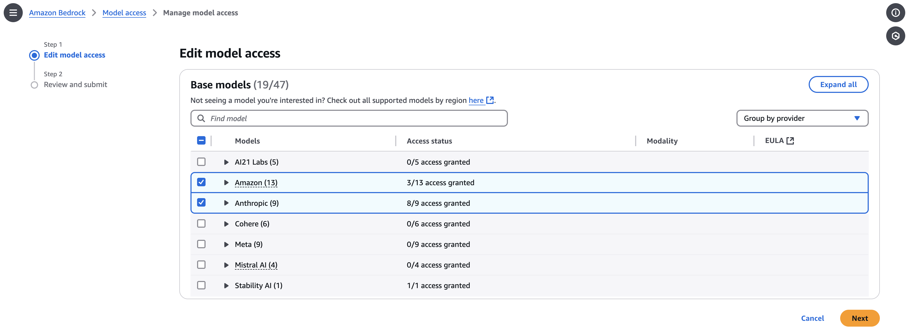
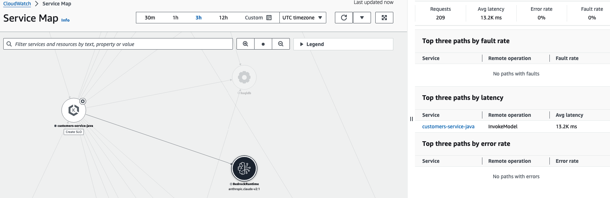
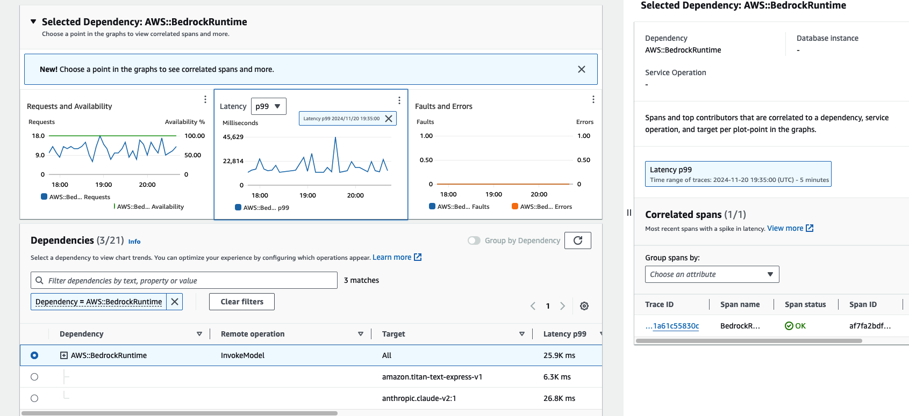
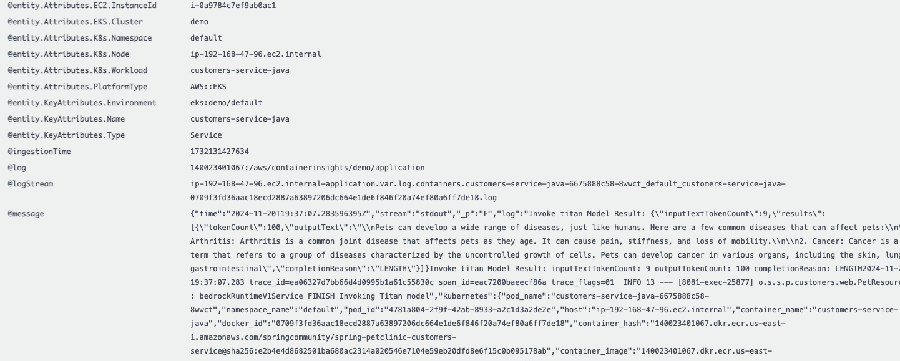

## Overview
This setup will demonstrate the integration of Application Signals and AWS Bedrock which
provides the observability on the prompting queries to different large language models hosted 
by Bedrock service via specific Application Signals Metrics, Logs and Traces.  

## Setup Requirements 
Make sure you have enabled Amazon Titan and Anthropic Claude Models in AWS Bedrock console.
1. Go to AWS Bedrock Service Console
2. Click `Model access` at the bottom of left navigation bar
3. Select `Amazon` and `Anthropic` checkbox to enable their models and click `Next`

### Problem Solved
- Provide Latency/Fault/Error metrics to show the performance on the prompts to each specific LLM models 
- Provide the correlations among Metrics, Traces and Logs for each Bedrock GenAI prompt request 

## Demo Steps
1. Go to Service Map and search "Bedrock runtime"
   1. 
2. Found Two models Titan Express and Claude are being used and the latencies for some requests are >10s, click on metric graph points with long latencies
3. You will get the correlated spans in the drawer on the right side, click on the spans to get the detailed info
   1. 
4. Go to CW Log insights and the log reveals providing the following GenAI metadata attributes
   - gen_ai.system
   - gen_ai.request.model
   - gen_ai.request.max_tokens
   - gen_ai.request.temperature
   - gen_ai.request.top_p
   - gen_ai.usage.input_tokens
   - gen_ai.usage.output_tokens
   - gen_ai.response.finish_reasons
   
5. Call your ML engineer to fine tune the prompt query to reduce latency, token cost, etc.