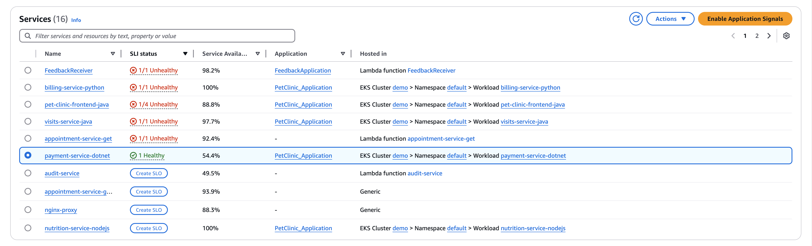
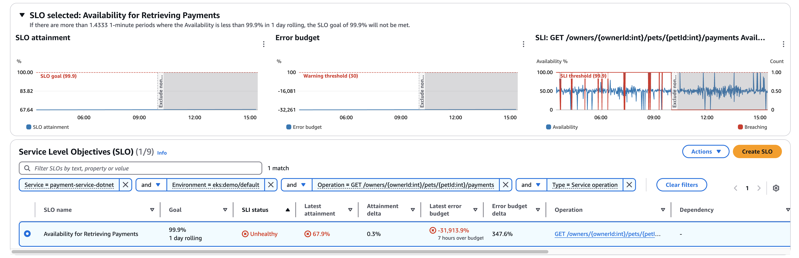
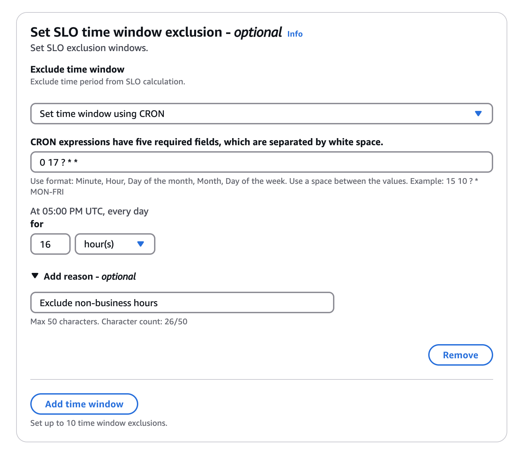

# Feature Name: Application Signals SLO with exclusion windows

## Overview
This demo will illustrate the new [exclusion window feature](https://aws.amazon.com/about-aws/whats-new/2025/03/slo-exclusion-time-windows-cloudwatch-application-signals/) for SLO

### Problem Solved
- Allows customers to exclude planned maintenance/downtime from impacting their SLO performance

## Setup Requirements
Follow the EKS setup in main [README](https://github.com/aws-observability/application-signals-demo?tab=readme-ov-file#eks-demo).

## Demo Steps
1. Go to Service and scroll down to the list of services deployed in the account. Select the `payment-service-dotnet` service.

2. Click into the selected service. View all SLOs on the `GET /owners/{ownerId:int}/pets/{petId:int}/payments` operation.

3. Adjust the time picker to include 5 PM PST to 9 AM PST and observe the demo exclusion window. Exclusion windows can be added or modified on the Edit SLO page.

