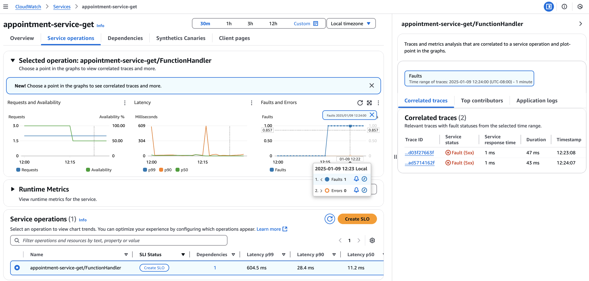
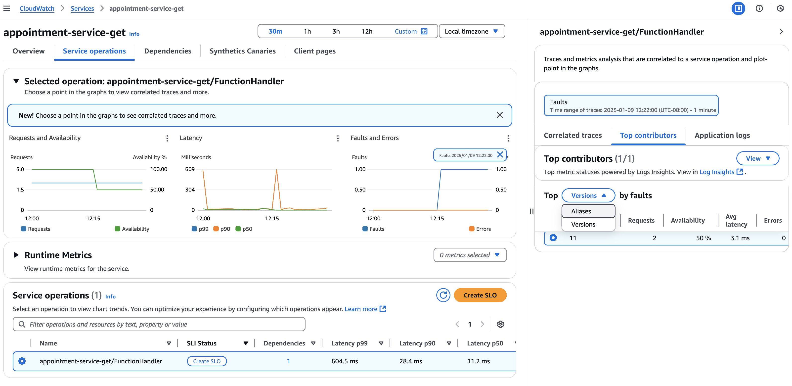

# Feature Name: Application Signals for AWS Lambda

## Overview
Application Signals for AWS Lambda provides detailed insights into function execution, enabling enhanced debugging, performance monitoring, and observability for serverless applications.

### Problem Solved
- Addresses the challenge of limited visibility in distributed serverless environments.
- Key benefits:
   - Seamless integration with AWS X-Ray for tracing.
   - Real-time metrics to monitor Lambda performance and identify bottlenecks.
   - Reduced operational overhead with preconfigured signal collection.

## Setup Requirements
1. **Prerequisite Systems**:
   - Configure AWS credentials on your local machine:
     ```bash
     aws configure
     ```
     Provide the following details when prompted:
      - **AWS Access Key ID**
      - **AWS Secret Access Key**
      - **Default Region Name** (e.g., `us-east-1`)
      - **Default Output Format** (e.g., `json`)
2. **Required Software/Tools**:
   - Python3 (`v3.12` or higher).
   - Terraform (`v1.5` or higher) for infrastructure provisioning.
3. **Install the demo**:
   ```
   cd lambda-petclinic && ./installDemo.sh
   ```
4. **Clean up**:
   ```
   cd lambda-petclinic/terraform && terraform destroy -auto-approve
   ```


## Demo Steps
The demo will install three Lambda functions: appointment-service-create, appointment-service-get, and appointment-service-list. These functions will be automatically invoked periodically to generate signals for the demo. Users can follow the documentation below to observe the expected results in the CloudWatch Console.

## Expected Results
- **Application Signals Services**: 
  - The Lambda functions are detected and displayed under __Services__.
  
- **In Lambda service**:
    - Clicking a data point in the metrics dashboard, you can correlate it with a trace in the __Correlated Traces__.
      
    - Clicking a data point in the metrics dashboard, you can further drill down by selecting the Lambda function's Alias or 
      Version in the __Top Contributors__
      

