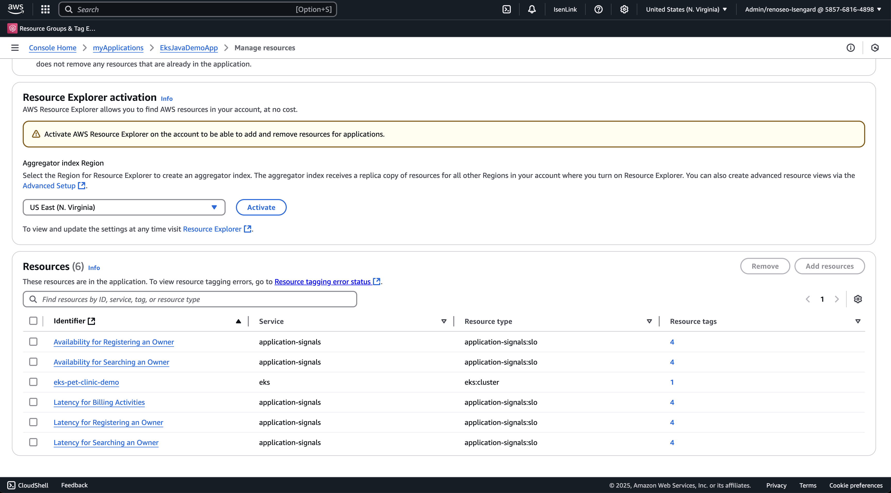

# Feature Name: Application Signals integration with myApplications

## Overview
This setup will demonstrate the integration of Application Signals with [myApplications](https://docs.aws.amazon.com/awsconsolehelpdocs/latest/gsg/aws-myApplications.html).

### Problem Solved
- Provides a high level view of all resources of a customer defined application. 

## Setup Requirements
Follow the EKS setup in main [README](https://github.com/aws-observability/application-signals-demo?tab=readme-ov-file#eks-demo).

## Demo Steps
1. Go to Service and scroll down to the list of services deployed in the account. You will see that under the Application column, there is a link to `EksJavaDemoApp`. These services are all linked to `EksJavaDemoApp` as they are deployed to the same EKS cluster.
   2. 
2. Go to Service Level Objectives and see the list of SLOs in the account. You will now see that the SLOs are tagged to the same `EksJavaDemoApp`.
   3. 
3. When you click on the hyperlink of the `EksJavaDemoApp`, you will be taken to myApplications directly. Here, if you go into manage resources, you will see all the resources that belong under `EksJavaDemoApp`. 
   4. 