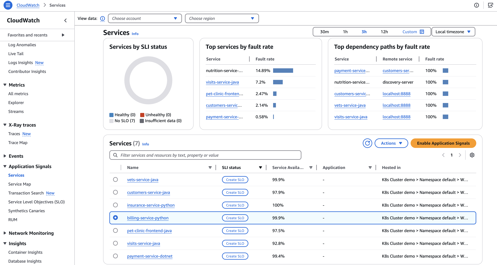
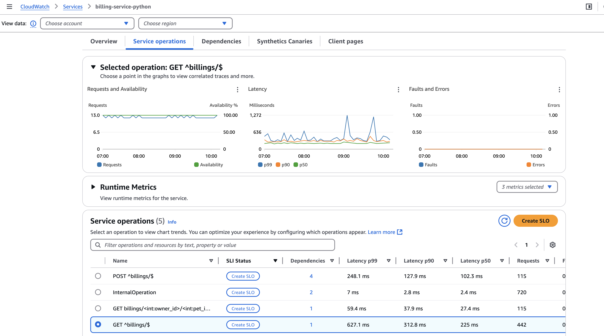
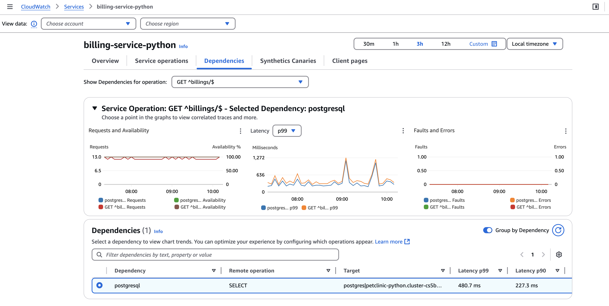
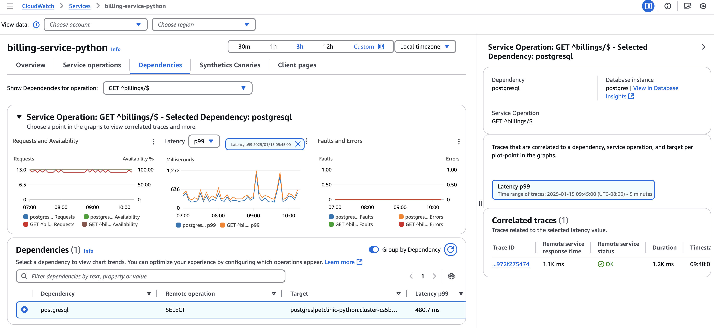
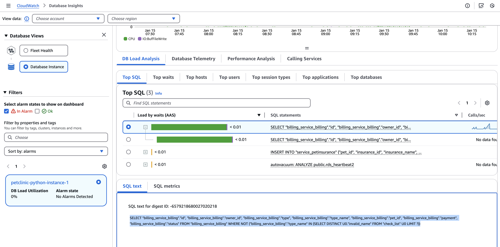

# Feature Name: Application Signals integration with Database Insights

## Overview
This setup will demonstrate the integration of Application Signals with [Database Insights](https://docs.aws.amazon.com/AmazonCloudWatch/latest/monitoring/Database-Insights.html).

### Problem Solved
- Provides the link to jump to the relevant Database Insights page for a database dependency
- Shows the SQL text and various database metrics

## Setup Requirements
Follow the EKS setup in main [README](https://github.com/aws-observability/application-signals-demo?tab=readme-ov-file#eks-demo).

## Demo Steps
1. Go to Application Signals services and click `billing-service-python` in the list.
   1. 
2. Click "Service operations" tab and then select `GET ^billings/$`. You can see both the requests/availability and faults/errors charts are showing constant lines but there are lot of fluctuations in the latency chart. Click the Dependency link (blue text `1`) in the row for `GET ^billings/$`.
   1. 
3. You will be redirected to the "Dependencies" tab with the selected operation `GET ^billings/$`
   1. 
4. Click a spike in the latency graph and you will see a right panel with a link to Database Insights. Click the link "View in Database Insights". 
   1. 
5. The relevant page in Database Insights will show up. You can select "Top SQL" tab which reveals the SELECT query. This query retrieves billing records from the billing service table, excluding any records whose type names are listed as invalid in the checklist table. In this case, the spiky behavior of the database query is caused by missing index on the check_list table. 
   1. 

